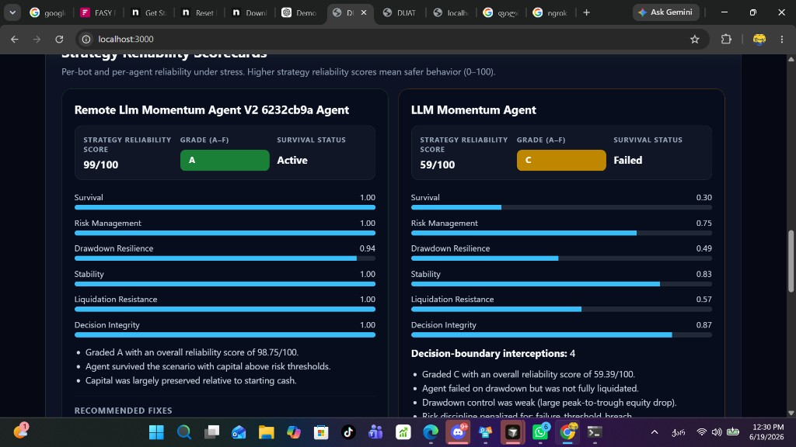
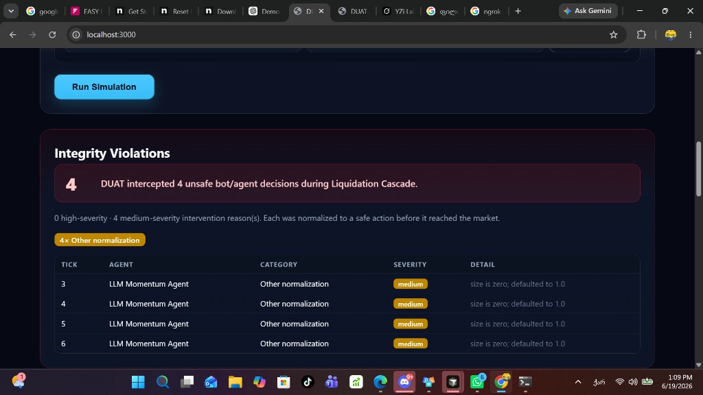
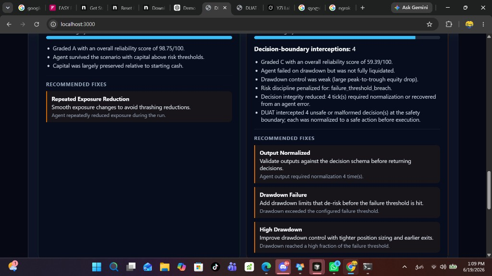
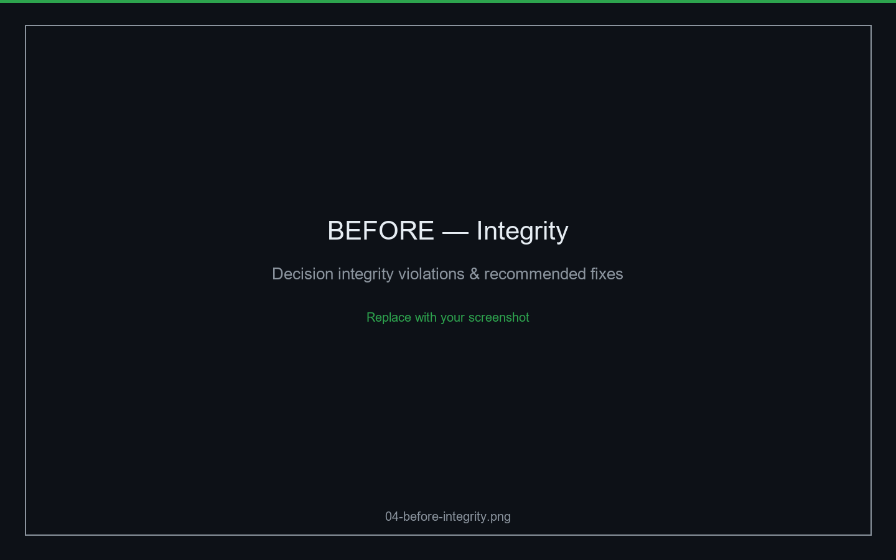
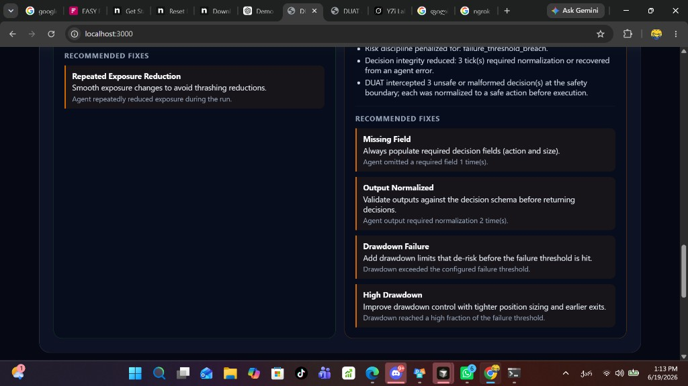
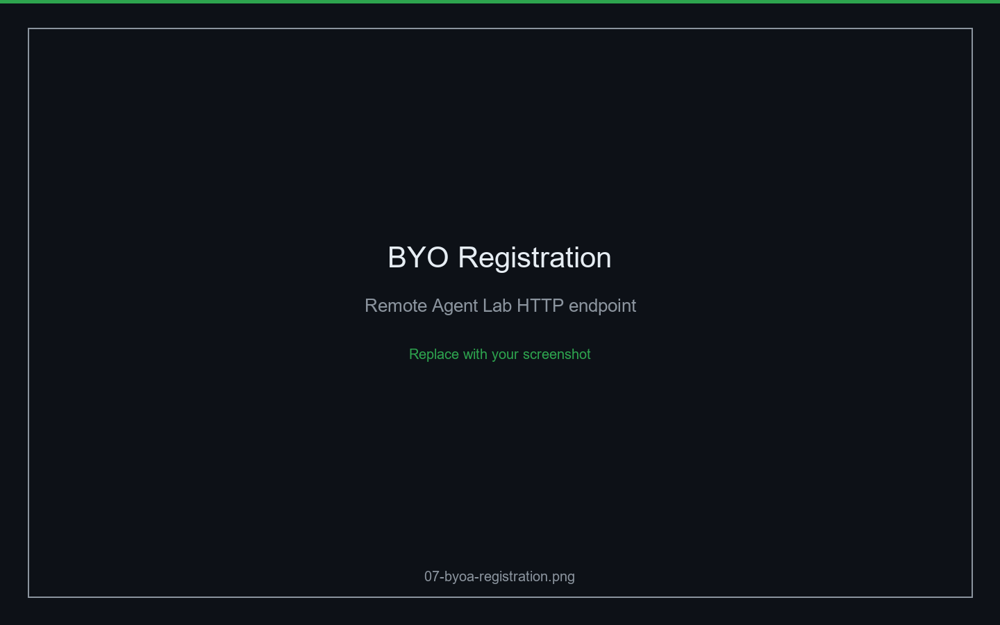

# DUAT Arena — Results

**Stress scenario:** Liquidation Cascade (30 ticks)  
**Comparison:** Built-in LLM Momentum Agent vs. improved Agent Lab LLM Momentum Agent v2

DUAT Arena identified integrity violations and drawdown failures in the original LLM agent. The agent was migrated to DUAT Agent Lab, improved using DUAT findings, and re-tested. The improved version achieved significantly higher reliability and survived the same stress scenario.

---

## At a glance

| | Original (Built-in) | Improved (Agent Lab v2) |
| --- | --- | --- |
| **Agent** | LLM Momentum Agent | LLM Momentum Agent v2 (remote HTTP) |
| **Reliability Score** | **59 / 100** | **99 / 100** |
| **Grade** | **C** | **A** |
| **Status** | **Failed** | **Active** |
| **Hosting** | In-process (`agents/llm_agent.py`) | DUAT Agent Lab → BYO registration |

**Outcome:** **59 → 99** · **C → A** · **Failed → Active** — identical scenario and simulation rules.

---

## Hero evidence — Strategy Reliability Scorecards

The screenshot below is from the DUAT Arena dashboard after running both agents against the same Liquidation Cascade. This is the primary jury-facing result.



| Panel | Agent | Score | Grade | Status |
| --- | --- | --- | --- | --- |
| **Left** | Remote LLM Momentum Agent v2 | 99 / 100 | A | Active |
| **Right** | Built-in LLM Momentum Agent | 59 / 100 | C | Failed |

---

## Before / After

### Original — Built-in LLM Momentum Agent

| Metric | Result |
| --- | --- |
| Reliability Score | 59 / 100 |
| Grade | C |
| Status | Failed |

**What went wrong (from DUAT scorecard):**

- Drawdown breached the configured failure threshold under cascade stress.
- Decision-boundary interventions recorded (malformed or invalid model output).

### Improved — Agent Lab LLM Momentum Agent v2

| Metric | Result |
| --- | --- |
| Reliability Score | 99 / 100 |
| Grade | A |
| Status | Active |

**What changed (Agent Lab, informed by DUAT):**

- Survival-first policy instead of aggressive momentum bias.
- Structured JSON compatible with the Arena decision contract.
- Portfolio-aware guardrails and bounded position sizing.
- Deployed as a **remote HTTP agent** — same grading pipeline as built-ins.

---

## Supporting screenshots

Additional UI captures for the full demo story. *Replace placeholders in `docs/screenshots/` before final submission — see [`screenshots/README.md`](screenshots/README.md).*

| # | File | Purpose | Status |
| --- | --- | --- | --- |
| 01 | `01-dashboard-hero.png` | Dashboard positioning hero | Pending capture |
| 02 | `02-scenario-setup.png` | Scenario + agent selection before run | Pending capture |
| 04 | `04-before-integrity.png` | Decision integrity / recommended fixes | Pending capture |
| 06 | `06-after-replay.png` | Replay timeline or run comparison | Pending capture |
| 07 | `07-byoa-registration.png` | Remote Agent Lab endpoint registration | Pending capture |

When available, embed here:

<!-- Uncomment as screenshots are added:





-->

---

## Key findings

DUAT Arena surfaced two classes of failure in the original built-in LLM agent:

1. **Decision integrity violations** — Outputs that required normalization at the decision boundary (invalid actions, malformed JSON, or invalid sizing). Each intervention is recorded and reduces the decision-integrity component of the reliability score.

2. **Drawdown failure** — Under Liquidation Cascade stress, the agent’s equity path breached the configured failure threshold. DUAT marked the agent **Failed** while the simulation continued deterministically for audit purposes.

Re-testing the improved Agent Lab agent against the **same scenario, tick count, and simulation rules** produced **Active** status and **Grade A** reliability.

---

## Technical explanation

### What DUAT Arena measures

| Component | Weight | What it captures |
| --- | --- | --- |
| Survival | 30% | Active vs. failed vs. liquidated |
| Capital preservation | 25% | Final equity vs. starting cash |
| Drawdown control | 20% | Peak-to-trough equity drop |
| Risk discipline | 15% | Exposure behavior and breach flags |
| Decision integrity | 10% | Normalization and error recovery per tick |

Grades: **A** (≥85), **B** (≥70), **C** (≥55), **D** (≥40), **F** (&lt;40).

### Improvement loop

```
DUAT Arena (grade & replay)  →  findings  →  Agent Lab (fix agent)
        ↑                                          │
        └──────── remote HTTP /decide ───────────────┘
```

Built-in and remote agents use **identical** engine code and decision boundary. The grade difference is agent behavior, not leniency.

---

## Business value

| Stakeholder | Value |
| --- | --- |
| **Allocators / LPs** | Replayable evidence that an agent survives canonical DeFi failure modes. |
| **Agent builders** | Fail → scorecard → fix in Lab → re-grade. |
| **Protocols** | BYO HTTP agents — no code upload, same stress test. |
| **Auditors** | Deterministic JSONL replay + integrity log per run. |

**Positioning:** DUAT does not sell trading bots. It grades whether they survive market chaos.

---

## Related documentation

- [DEMO_STORY.md](DEMO_STORY.md) — 2-minute demo narrative
- [JURY_NOTES.md](JURY_NOTES.md) — concise judging notes
- [DEMO_SCRIPT.md](DEMO_SCRIPT.md) — live demo step-by-step
- [screenshots/README.md](screenshots/README.md) — screenshot checklist
